# Project 4 - Design & Plan

Be clear and concise in your writing. Bullets points are acceptable.


# Planning

## Client Description (Milestone 1)
> Tell us about your client. Who is your client? What kind of website do they want? What are their key goals?

Our client is Amber Dance Troupe, founded in 2003. This is performing group that focuses on promoting Chinese tradition folk dance, contemporary dance, and jazz. The hold workshops every week, perform across campus, and hold annual showcase.

They want an informative website, and they also want to include recruitment information. They want a website that is welcoming for target audience, and they want to promote the club as well as its cultural influence. Further details are included in the purpose section.

> NOTE: **If you are redesigning an existing website, give us the current URL and some screenshots of the current site.** Tell us how you plan to update the site in a significant way that meets the Project 4 requirements.

N/A


## Site's Purpose (Milestone 1)
> Tell us the purpose of the website and what it is all about.

We are making a website for Amber Dance Troupe (focusing on Chinese tradition/folk dance, contemporary dance, and jazz), and this cite will be an informative presentation of the club; it should also contain information/form for E-Members, G-Members to look over and interact with.

Our client's target audience is female Cornellians who are committed to dancing. Our audience is targeted at females who have a passion for Chinese dance and are interested in joining the club!


Here are some pages/information that our client expects to see:
  - information about club history
  - information about current workshops
  - E-board introduction and recruitment info
  - instructors introduction
  - annual showcase information
  - event page: performance schedule + social events
  - order form for club members (to collect information about costume size)
  - club contact info
  - photo gallery


## Client Meeting Notes (Milestone 1)
> Include your notes/minutes from the client meeting, an email they sent you, or whatever you used to keep track of what was discussed at the meeting.


## Client Needs and Wants (Milestone 1)
> Collect your client's needs and wants for the website. Come up with several appropriate design ideas on how those needs may be met. In the **Memo** field, justify your ideas and add any additional comments you have. There is no specific number of needs required for this, but you need enough to do the job.

Needs/Wants: Color Scheme
- **Needs and Wants** [What does your client need and want?]
  - Color scheme matches the club's color
- **Design Ideas and Choices** [How will you meet those needs and wants?]
  - Use a bluish green (e.g. #49989c ) and white as part of design
  - also a light grey color (#F8F8F8)
- **Memo** [Justify your decisions; additional notes.]
  - N/A

Needs/Wants: Club History & interaction element
- **Needs and Wants**
  - The club was founded in 2003, and it has a very rich history. Our client values it, and wants to make sure that club history is on the site.
- **Design Ideas and Choices**
  - Create a page on club history
  - Have a photo gallery for past performances
- **Memo**
  - N/A

Needs/Wants: Workshops
- **Needs and Wants**
  - Workshop is a big part of the club's activities, and my client expects many people to look for workshop and Instructors information together: people who are interested in the club, club members, other performing arts clubs, etc.
  - Because the club hosts 3 or 4 workshops per week, there will a big list of workshops. So, my client expects that we can sort workshops by the type of dance (tradition dance, contemporary dance, jazz).
- **Design Ideas and Choices**
  - Create a page on workshops
  - toggle Information
  - 3 style of dances listed with time and place
- **Memo**
  - N/A

Needs/Wants: Events
- **Needs and Wants**
  - The club is always invited by many other organizations, and the our client wants to show their performance schedule on their site
  - The club hosts one formal and one semi-formal event every semester; this will be for club members only
- **Design Ideas and Choices**
  - this will be a dropdown in the nav bar
  - dropdown will be showcase, performances and social events
- **Memo**
  - N/A

Needs/Wants: Contact
- **Needs and Wants**
  - Our client wants to make sure that people who are interested in the club (to join or to collaborate) can contact the club
- **Design Ideas and Choices**
  - we can put contact info in the footer of every page
- **Memo**
  - N/A

Needs/Wants: Eboard Member page
- **Needs and Wants**
  - This page will be for current club members and anyone interested in joining to see who is in charge
  - Eboard to see who who is in charge and their role in the club
- **Design Ideas and Choices**
  - Create a page that introduces current Eboard members and their roles and responsibilities
  - name, year, major

- **Memo**
  - N/A

Needs/Wants: Annual Showcase
- **Needs and Wants**
  - The club holds an annual showcase at the end of spring semester. This is a big event for the club.
- **Design Ideas and Choices**
  - Create an Events page
  - a page on annual showcase information as a dropdown from events
  - will contain a memo about past years showcases as well as pictures
- **Memo**
  - N/A


Needs/Wants: Performances
  - **Needs and Wants**
    - the club has a bunch of performances throughout the semester to promote awareness of their club as well as their Showcase
    - for example a performance during Freshman move in day or performances in Ho plaza
  - **Design Ideas and Choices**
    - performances will be a page under the events dropdown in the nav bar
    - will contain location and time of the performances
  - **Memo**
    - N/A

Needs/Wants: Social Events
    - **Needs and Wants**
        - the club has a bunch of social events throughout the semester to get to know the members in the club
        - awesome way to get to know others and connect outside of practice times
    - **Design Ideas and Choices**
        - social events will be a page under the events dropdown in the nav bar
        - will contain location and time of the social events throughout the semester
        - may contain pictures
     - **Memo**
        - N/A


## User(s) (Milestone 1)
> Tell us about the users (target audience) for this website.

Our overall target audience is females at Cornell University. Our audience is targeted at any females at Cornell University that are interested in joining a dance group or becoming more involved in the dance world (no experience necessary). Furthermore, our website is helpful for females that are already in the dance group. This allows the entire group to collaborate with each other and keep up to date on current events and competitions.

## Discovering Users' Needs (Milestone 1)

- Notes for Female who is interested in joining a dance troupe and has a passion for dance and practicing.


> You'll need to discover your users' needs. Talk to them! Document what you've learned about them. When talking to your users, take notes and include those notes here.

Note for club member interview


Interview with potential collaborator:
Member of jazz group
Has collaborated with other groups before

How did your group contact the other groups you have collaborated with?
- They have usually known someone in the group, and talked with that person about collaborating
- This talking was usually done over phone or in a group chat

What about these other groups convinced you to collaborate with them?
- Again, they knew people from the other groups, and thought it would be fun to collaborate with them
- They saw that they liked the other groups work and like it
- They thought they would work well together

What kind of information would be helpful to get together with a group you might want to collaborate with?
- Contact information, cellphone number or email
- general information about the group, when they meet, what kind of work they do, the general work attitude they have


## Users' Needs (Milestone 1)
> Analyze the users' needs and wants from your notes above. List each need/want below. There is no specific number of needs required for this, but you need enough to do the job.
> **Note:** These are probably *not* the needs of your client.

Need/Want: Culture
- **Needs and Wants** [What do the users need and want?]
  - The user wants to know the culture or the group and what the entire groups mission and goals are
- **Design Ideas and Choices** [How will you meet those needs and wants?]
  - Creating a page that reflects the history as well as the key values
- **Rationale & Additional Notes** [Justify your decisions; additional notes.]
  - N/A

Need/Want: Practice Times
- **Needs and Wants** [What do the users need and want?]
    - The user wants to know the commitment level and different practice times or workshops that are offered and when
- **Design Ideas and Choices** [How will you meet those needs and wants?]
    - Creating a page that is designated to practice times and workshops. It will also include the location of the meetings.
- **Rationale & Additional Notes** [Justify your decisions; additional notes.]
    - N/A

Need/Want: Leaders
- **Needs and Wants** [What do the users need and want?]
    - The user wants to know the leaders in the group
- **Design Ideas and Choices** [How will you meet those needs and wants?]
    - Creating a page that is designated to who is in charge and different members that are in the group
- **Rationale & Additional Notes** [Justify your decisions; additional notes.]
    - N/A

Need/Want: Photos/Videos
- **Needs and Wants** [What do the users need and want?]
    - The user wants to be able to view photographs and videos to judge skill level
- **Design Ideas and Choices** [How will you meet those needs and wants?]
    - Creating a page that is designated to a specific gallery in order to attract more individuals
- **Rationale & Additional Notes** [Justify your decisions; additional notes.]
    - N/A

Need/Want: Equipment/Prices
- **Needs and Wants** [What do the users need and want?]
    - The user wants to be able to know the specific costs and any equipment  they need to buy in order to successfully integrate themselves in the club
- **Design Ideas and Choices** [How will you meet those needs and wants?]
    - Under the about page it will include a form where females can sign up for sizes for costumes. It will also list the total cost of the club
- **Rationale & Additional Notes** [Justify your decisions; additional notes.]
    - N/A

Need/Want: [Club member - Workshops/sessions]
- **Needs and Wants** [What do the users need and want?]
  - Need to know if a workshop is happening: if it is, when and where
  - Only look for particular workshops that one wants to attend
- **Design Ideas and Choices** [How will you meet those needs and wants?]
  - Clearly list the timing and location of every workshop / practice session
  - Enable sorting of workshops/practice by type
- **Rationale & Additional Notes** [Justify your decisions; additional notes.]
  - N/A

Need/Want: [Club member - Instructors]
- **Needs and Wants** [What do the users need and want?]
  - Do not tend to care too much on this
- **Design Ideas and Choices** [How will you meet those needs and wants?]
  - Have a page on instructors for those who may be interested, but not combine with workshops
- **Rationale & Additional Notes** [Justify your decisions; additional notes.]
  - N/A

Need/Want: [Club member - Event]
- **Needs and Wants** [What do the users need and want?]
  - Time for social event is importance
  - Time, location, and practice workshop for performance is important
- **Design Ideas and Choices** [How will you meet those needs and wants?]
@@ -165,28 +229,45 @@
- **Rationale & Additional Notes** [Justify your decisions; additional notes.]
  - N/A

Need/Want: [Non Club member - Collaborator]
- **Needs and Wants**
  - Need information about how to contact the group
  - Information about the type of collaboration the group is interested in working on
- **Design Ideas and Choices**
  - A page about collaboration could be made that provides contact information as well as specifics about collaborating with the dance troupe.
- **Rationale & Additional Notes**
  -

## User Testing Plan (Milestone 1)
> Plan out your tasks for evaluating whether your site will meet the needs of the users. These must be actual user testing tasks. Tasks are not questions!


1. You found a flyer that said Amber Dance Troupe is now taking applications to join. Navigate through the website to apply to be a part of the team.

2. You want to attend a workshop, but you don't know when and where it is. Find the time and location for the workshop you are interested in attending.

3. You are very interested in Amber, and you want to see some past photos of the club.

4. It's the spring and you want to find more things to do. You are interested in attending the annual showcase. Navigate to get more information on the event.


## Content (Milestone 1)
> Plan out your site's content (text, images, etc.). Make a list of **all** the content you will need. This list should be **exhaustive**.

- Homepage (i.e history, mission, values, culture)
- Current Workshops(i.e practice times, locations, types of workshops)
- eBoard and Instructors(photos and description of positions)
- For Members (application and forms)
- Annual Showcase
- Gallery
- Contact (i.e collaboration)

## Interactivity Ideas (Milestone 1)
> Come up with some idea for interactive features for your site.

- Forms
     - application form to be part of the executive board
        - including information about each positions
        - will state your name, year, college and why you want to be apart of Eboard
- Gallery
    - containing pictures of past performances and members of the group
- Dropdown for the nav bar
    - dropdown will contain performances, showcase, and social events all under the events header
    - allows for organization and to include multiple types of events
- Toggle
    - this toggle will allow users to specifically view different styles of dance particularly the ones that they are interested in
    - prevents users from scrolling and finding information that they can't seem to other wise

# Design & Evaluation

## Design Process (Milestone 1)
> Document your design process. Show us your card sorting. Design your navigation from the card sorting. Outline your navigation. Describe your theme. Show us sketches of your site (mobile and desktop versions). etc.
> You should show us how your came up with your design and how your iterated on that design; show us the evolution of your design.

> **Note:** Card sorting is used to organize your site's content. For each piece of content identified in the previous section, write a summary of that content onto a card. Now sort the cards. The grouping of cards provides you with your pages for your website. **Do not write down the pages you want and then "card sort" those. That is not card sorting.**


This card sort is broken down into a nav-bar that includes the homepage, about, workshop, instructors, and contact. The homepage will include the clubs values and a gallery. The about page will contain the history, mission and culture. Workshops will contain practice times, location, style, showcase, and ticket information. The instructors page will contain members, year, experience and age. Lastly, the contact page will include an order form, emails, and collaboration. This card sorting will reflect our clients needs and wants.

The card sort is broken down into the homepage, about, workshops, collaboration and contact. The homepage will include values and the gallery. The about page will contain history, mission, culture, instructors, members, age, year, experience. The workshops page will include practice times, location, style, showcase, type of dance, place and ticket information. The collaboration page will include other organizations. Finally the contact page will include the order form and emails.

This card sort is broken down into the homepage, workshops, instructors, showcase, collaboration, gallery and contact. The homepage includes about information such as the history, mission, culture and value. The workshop page includes practice times, location, and dance style. The instructors page includes members, year, experience and age. The showcase page includes time, place and ticket information. The collaborations page has other organizations. The gallery contains pictures and the contact contains order form and the emails of others.

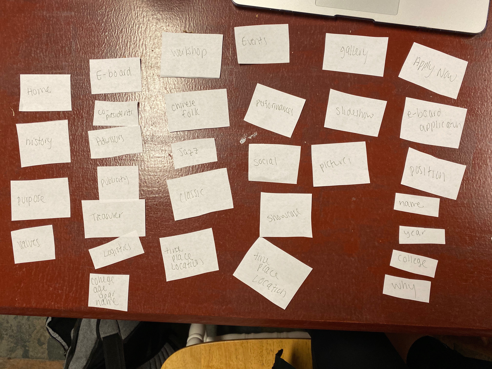

Our final design came from card sort 4. We found that the homepage and the about page were the same thing so we decided to combine them as the homepage with the nav bar labeled HOME. Our nav bar includes home,E-board, workshops, events, gallery and a apply now page. The homepage includes images of the group as well as the dance groups key values, history and purpose. The E-board contains information on the members in the group. It includes information on their position, year, college and their name. This information is necessary for anyone who is interested in learning more about the club and wanting to contact others. The workshops page will contain a toggle bar that contains the three styles of dances. The user will be able to choose which style of dance they want to explore further and click on that page. There will be a hover interaction feature as well. This allows the user to view and organized website and won't have to scroll to find a style of dance they are specifically looking for. The events tab includes a dropdown menu of performances, showcases and social events. The performances page includes the variety of performances throughout the year. The annual showcase is the clubs really big performance. It will contain information about the event as well as past years with a bunch of pictures. The social events page will include a variety of different events throughout the year to get to know members in the group outside of dance practice. It is an awesome opportunity to connect and interact with others. Finally, the gallery will contain a slideshow of pictures the user can scroll through. These pictures will be from practices, performances or everyday lives of the individuals in the group. Finally, the apply now page will include an application to become apart of e-board. The form will contain a list of the different positions as well as an application form including why you want to be on the e-board, age, name, year and college.

This card sort and design fit best with our target audience and all of the users needs.

The theme for our website is inviting and should be informative towards our user audience. We utilized a blue, grey and black color scheme in order to add a calming affect to our audience. We want our designs to be clean, crips and welcoming because we want to attract new dancers to our group. Dance is very powerful and warming so we tried to incorporate that into the theme and style of our website.


## Interactivity (Milestone 1)
> What interactive features will your site have? Describe how the interactivity connects with the needs of the clients/target audience.

Forms: part of the purpose of the website is to recruit, and that includes E-board application. The current club member is also part of the user of the website, and they need to submit information about their costume sizes. Hence, a form can help my client to gather information on running the club in the future.

Photo gallery: as a performing group, our client has many photos on their past performances and practices. Since they want to promote the club, and one way to do that is to present their hard works in the past. Plus, when it comes to performing art, it is easier to show the purpose and dedication through some visual components, like photos. So, a photo gallery will help our client to better achieve another main purpose of their website: to promote the club.

Toggle: the website is also serving current club members. These members are interested in different types of dances, and they need information on their own workshops and practices. Yet, these members, as Cornell students, are busy. They won't want to waste time on trying to browse through all the workshops and practice sessions every time. So, enabling a sorting function for workshops saves time for club members to better find information themselves.

Dropdown: the website will contain a dropdown in the nav bar.This dropdown will be named events and will dropdown into three sub categories: performances, showcases, and social events. These drop downs will contain various information that the user will be able to easily navigate throughout the site.


## User Testing (_optional_)
> This testing is optional.

### User 1 - Testing Notes (Milestone 1)
> When conducting user testing, you should take notes during the test. Place your notes here.

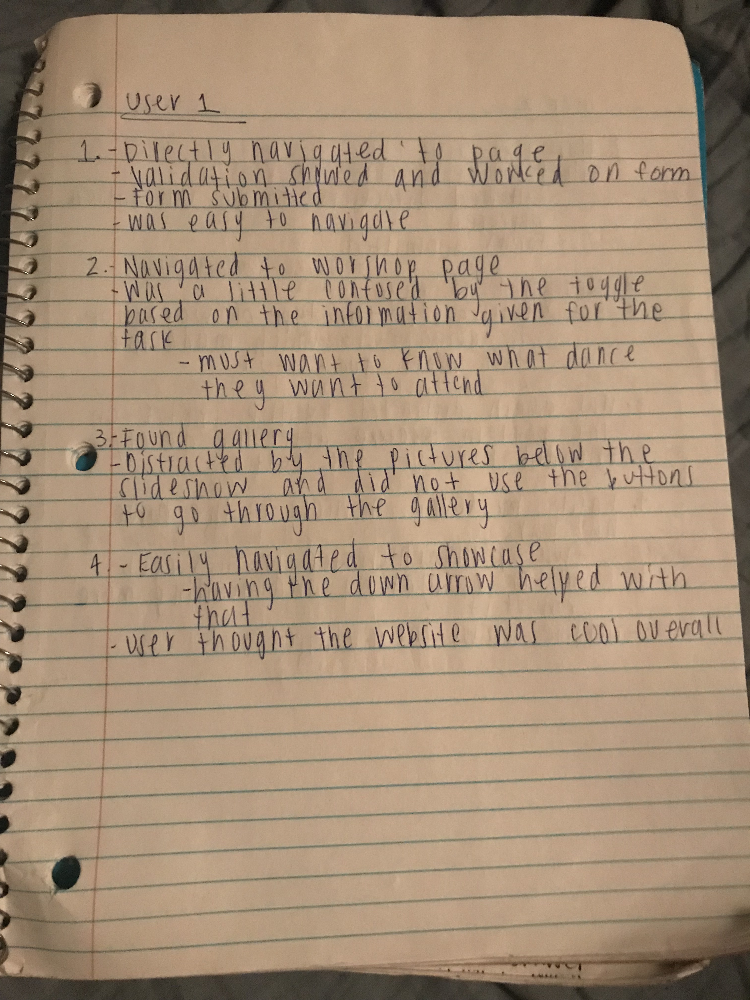
### User 1 (Milestone 1)
> Using your notes from above, describe your user by answering the questions below.

1. Who is your user, e.g., where does the user come from, what is the user's job, characteristics, etc.?

User 1 is a female from Cornell. She is a freshman in Arts & Sciences and is not very familiar with the clubs on campus and was very interested in learning more about new things.

2. Does the user belong to your target audience of the site? (Yes / No)
> If “No”, what’s your strategy of associating the user test results to your target audience’s needs and wants? How can your re-design choices based on the user tests make a better fit for the target audience?

Yes, the user belongs to the target audience


### User 1 - **Desktop** (Milestone 1)
> Report the results of your user's evaluation. You should explain **what the user did**, describe the user's **reaction/feedback** to the design, **reflect on the user's performance**, determine what **re-design choices** you will make. You can also add any additional comments. See the example design journey for an example of what this would look like.

Task: ALL
- **Did you evaluate the desktop or mobile design?**
  - Pick one: Desktop
- **How did the user do? Did they meet your expectation?**
  - Overall the user met my expectations. I did think that some users may be confused with the gallery page, but wanted to continue to test it before deciding to make changes to that page.
- **User’s reaction / feedback to the design** (e.g., specific problems or issues found in the tasks)
  - An issue that I came across, was that the way the second task was framed was not specific enough, so the user did not know what to look for based on the initial state of the page. The tasks also did not specify any constraints for the form, but I later found that this not including that information tests the validation of the form when the user ran into this issue.
- **Your reflections about the user’s performance to the task**
  - The users performance went very smoothly and indicated that the usability of the website was acceptable
  - The user was interested in the tasks, so it made the test more engaging and purposeful
- **Re-design choices**
  - Need to reframe the second task
  - Will wait to decide if the gallery should be redesigned
- **Additional Notes**
  - TODO: Justify your decisions; additional notes.


### User 2 - Testing Notes (Milestone 1)
> When conducting user testing, you should take notes during the test. Place your notes here.

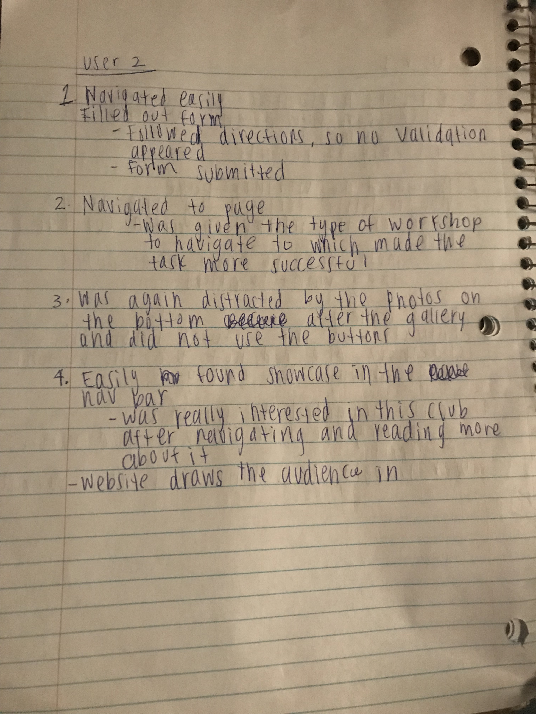
### User 2 (Milestone 1)
> Using your notes from above, describe your user by answering the questions below.

1. Who is your user, e.g., where does the user come from, what is the user's job, characteristics, etc.?
User 2 is also a female at Cornell. She is a freshman in Arts & Sciences and is involved in athletics on campus and clubs involved in leadership. She was not as interested in learning more about this club as the first user.

2. Does the user belong to your target audience of the site? (Yes / No)
> If “No”, what’s your strategy of associating the user test results to your target audience’s needs and wants? How can your re-design choices based on the user tests make a better fit for the target audience?

Yes, user 2 is part of the target audience

### User 2 - **Mobile** (Milestone 1)
> Report the results of your user's evaluation. You should explain **what the user did**, describe the user's **reaction/feedback** to the design, **reflect on the user's performance**, determine what **re-design choices** you will make. You can also add any additional comments. See the example design journey for an example of what this would look like.

Task: ALL
- **Did you evaluate the desktop or mobile design?**
  - Pick one: Mobile
- **How did the user do? Did they meet your expectation?**
  - User 2 had very similar results to user 1, but this time I reframed the task 2 to give them which workshop to find information for and the results were better.
- **User’s reaction / feedback to the design** (e.g., specific problems or issues found in the tasks)
  - This user was a little bit more serious about filling out the form and did not run into any validation errors. This user also was confused by the design on the gallery page and did not use the buttons to go through the slide show. The user was just not interested in looking at the pictures, as inferred by the expression on her face after navigated to the page. The task could be more specific to use the word browse through the pictures on the gallery page, but the interactive task should help the user put themselves in that scenario.
- **Your reflections about the user’s performance to the task**
  - I would still like to wait until completing all the user tests before deciding to change the design of the gallery. For the most part, this user also indicated that the site is usable and easy to navigate.
- **Re-design choices**
  - N/A
- **Additional Notes**
  - TODO: Justify your decisions; additional notes.

...


## Final Design (Milestone 1)
> Include the final sketches for each of your pages. These sketches **must** hand-drawn.

**Desktop Design:**


**Mobile Design:**

* Sketches of the mobile site:

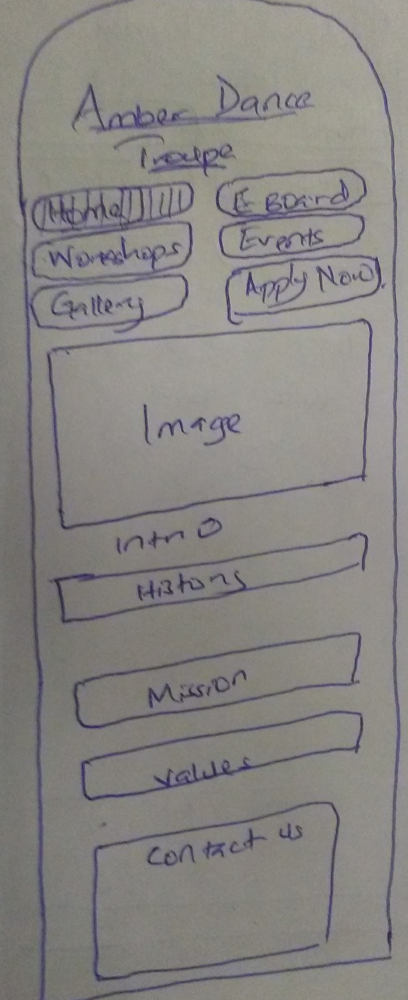


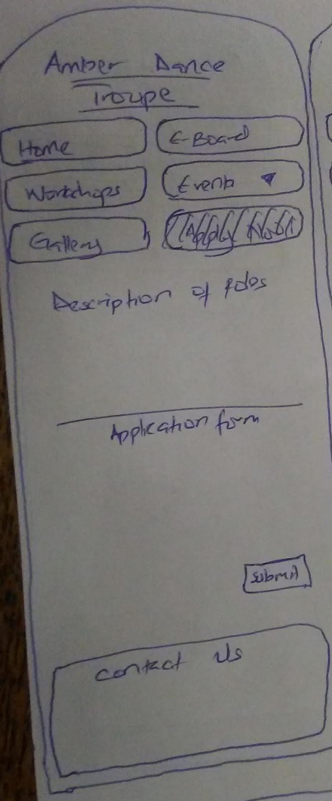


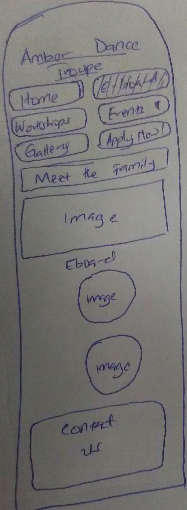


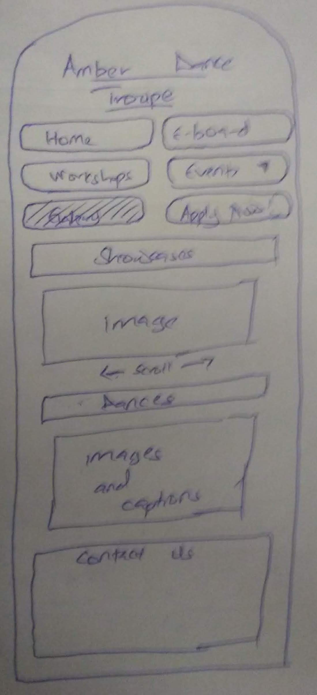


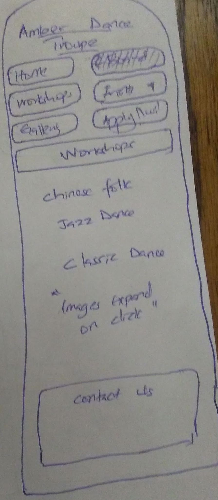


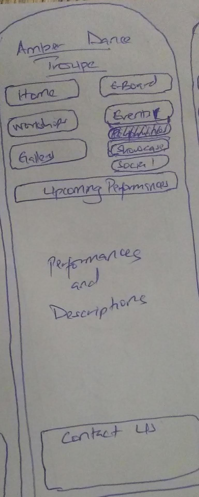


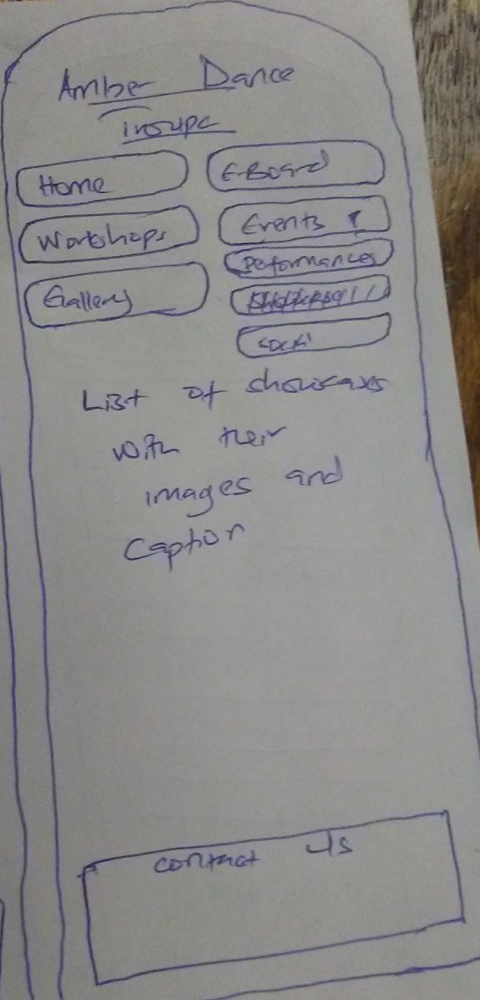


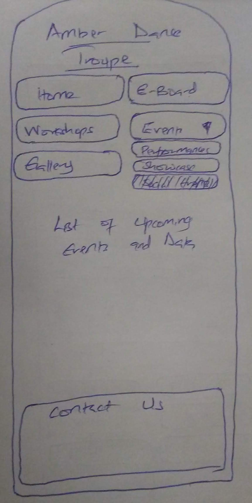


## Additional Comments (Milestone 1)
> If you feel like you haven't fully explained your design choices, or if you want to explain some other functions in your site (such as special design decisions that might not meet the Project 4 requirements), you can use this space to justify your design choices or ask other questions about the project and process.


---

# Iteration 2

## Client Feedback (Milestone 2)
> You have met once with your client a second time to discuss your initial design. Include your notes from the meeting, an email they sent you, or whatever you used to keep track of what was discussed at the meeting. Write a few sentences about the design feedback you received from your client.

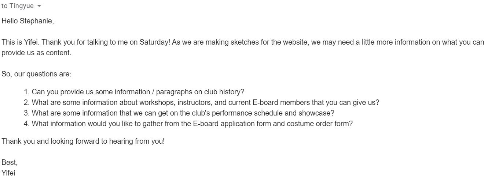

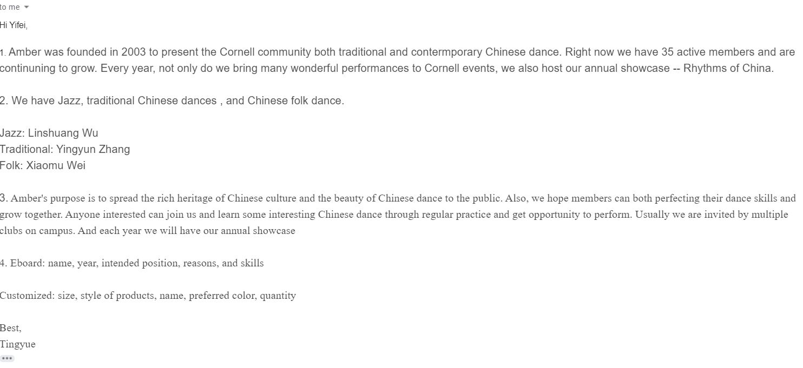

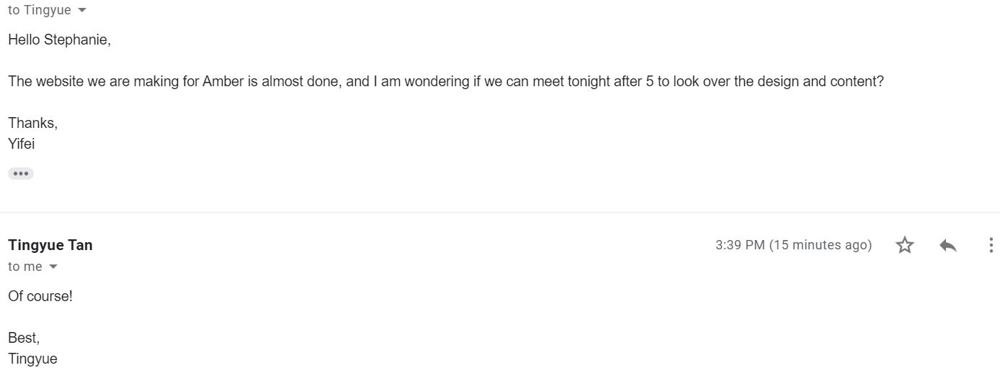

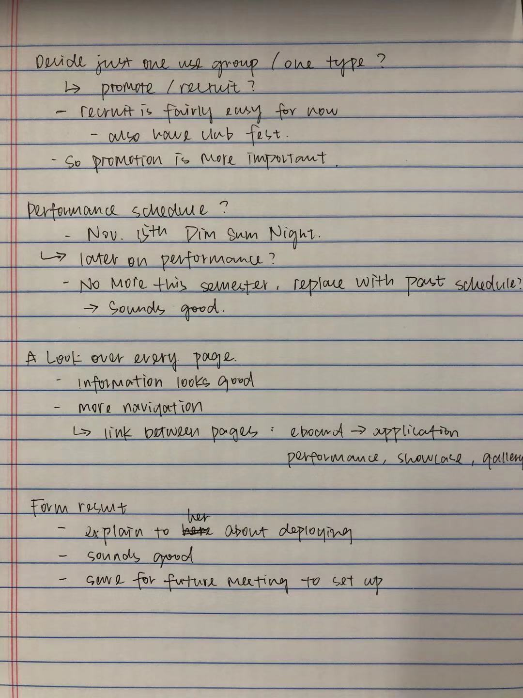

Summary of the second meeting:
The client understands that for the purpose of this project, we cannot target both people interested in the club and club members, so she is okay with us only designing the website for promotion purpose.

The client claims that there won't be any performances left for this semester, and she is okay with us using past performance schedule to complete this assignment.

The client likes the application form: she thinks that this is actually very close to the application they sent out in the past.

The client thinks that we can make navigation of the website more smooth: eboard page and application page can be linked, photo gallary and performance pages can be linked, etc.

The client and I also talked about sending the application form to an email account. We decide to save more detailed discussion to our next meeting.

## Interactivity Plan (Milestone 2)
> Write your interactivity pseudocode here.

```
when DOM is loaded:

  if the sub-tab of folk dance is selected:
    the workshop page toggles to hide information of jazz and classic dance
  elseif the sub-tab of jazz dance is selected:
    the workshop page toggles to hide information of folk and classic dance
  else (the sub-tab of classic dance is selected):
    the workshop page toggles to hide information of folk and jazz dance


  when the "event" tab on the nav bar is clicked:
    If the dropdown menu is visible:
      add class "hidden" to hide the dropdown menu
    else:
      remove class "hidden" to show the menu


  var photos = an array of all the photos in the slideshow

  var photoIndex = 0;

  When the "next" button of the slide show is clicked:
    if on the last image:
      change photoIndex back to 0
      change the value of "src" to the first element of photos array
    else:
      add one to photoIndex
      change the value of "src" to the photoIndex-th element of photos array

  When the "previous" button of the slide show is clicked:
    if on the first image:
      change photoIndex to the number of photos there are in the array
      change the value of "src" to the last element of photos array
    else:
      minus one from photoIndex
      change the value of "src" to the photoIndex-th element of photos array


  When "submit button" is clicked:

    if name field is empty:
      display error message "Please provide your name."
    else:
      hide the error message "Please provide your name."

    if nothing is selected for school year:
      display error message "Please select your school year."
    else:
      hide the error message "Please select your school year."

    if no college is checked:
      display error message "Please select your college(s)."
    else
      hide error message "Please select your college(s)."

    if no motivation of applying is given:
      display error message "Please tell us about why you want to apply!"
    else if the input provided is less than 50 characters:
      display error message "Please tell us about why you want to apply in more than 50 characters!"
    else:
      hide both error messages

    if no position is checked:
      display error message "Please select the position(s) you want to serve."
    else
      hide error message "Please select the position(s) you want to serve."

    if no input for reason of selecting above position(s) is given:
      display error message "Please tell us about your thoughts on the position(s) you select!"
    else if the input provided is less than 50 characters:
      display error message "Please tell us about the reasons for your picked positions in more than 50 characters."
    else:
      hide both error messages


```

## Additional Comments (Milestone 2)
> If you feel like you haven't fully explained your design choices, or if you want to explain some other functions in your site (such as special design decisions that might not meet the Project 4 requirements), you can use this space to justify your design choices or ask other questions about the project and process.

Because the dropdown menu, workshop toggle, and photo gallery requires javascript that we haven't started, we didn't make them visible for now. But the hidden pages are all here (we just commented them out), and the interactivity pseudocode is up too.

We are also waiting for more information to fill in on workshop and performance pages.

---

# Iteration 3

## Additional Comments (Milestone 3)
> If you feel like you haven't fully explained your design choices, or if you want to explain some other functions in your site (such as special design decisions that might not meet the Project 4 requirements), you can use this space to justify your design choices or ask other questions about the project and process.

Because our client no longer has any performance and social events left for this semester, and the date for showcase hasn't been decided yet, we used past performance and social event information for the sake of this project.


---

# Final Evaluation

## Changes Based on Lab 13 Peer Feedback (Final Submission)
> What changes did you make to your design based on your peers' feedback?

- add more padding to each section, title, and div
- change margins on pages to utilize more visual design strategies
- center photos on E-Board page
- remove font size changes on workshop toggle
- align text and photo on every page
- make form validation red
- find a new font for h1
- remove white space from footer

## User Testing
> If you conducted user testing in Milestone 1, you only need to user test 2 more users. Otherwise, you must conduct user testing with 4 users.

### User 3 - Testing Notes (Final Submission)
> When conducting user testing, you should take notes during the test. Place your notes here.

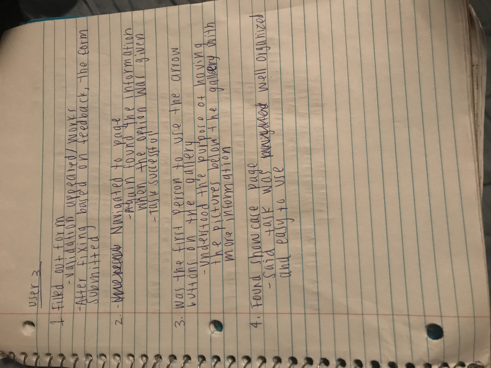

### User 3 (Final Submission)
> Using your notes from above, describe your user by answering the questions below.

1. Who is your user, e.g., where does the user come from, what is the user's job, characteristics, etc.?

User 3 is a female from Cornell. She is a junior in CALS and has attended classes at other schools, so she is used to the diversity and differences of other schools. She volunteered herself to participate, so it increases a factor of interest which can be something that can yield better results.

2. Does the user belong to your target audience of the site? (Yes / No)
> If “No”, what’s your strategy of associating the user test results to your target audience’s needs and wants? How can your re-design choices based on the user tests make a better fit for the target audience?

Yes, user 3 is a part of the target audience

### User 3 - **Desktop** (Final Submission)
> Report the results of your user's evaluation. You should explain **what the user did**, describe the user's **reaction/feedback** to the design, **reflect on the user's performance**, determine what **re-design choices** you will make. You can also add any additional comments. See the example design journey for an example of what this would look like.

Task: ALL
- **Did you evaluate the desktop or mobile design?**
  - Pick one: Desktop
- **How did the user do? Did they meet your expectation?**
  - Yes, user 3 met my expectations exactly how I expected all the users to respond. User 3 was able to perform task 2 when the task was reworded and the type of dance was given. This user also understood the purpose of having a slideshow gallery along with a collage of different dances. I received this answer with a follow-up question, so that I could see what was different in this user compared to the other two users. User 3 went in order down the page and was very observant. She mentioned how she went in order of the page which is how she knew to use the buttons unlike the the other two users that just scrolled directly down the page.
- **User’s reaction / feedback to the design** (e.g., specific problems or issues found in the tasks)
  - There were no issues in this task and said "This is a really cool website!"
- **Your reflections about the user’s performance to the task**
  - Since this user is older than the other two users, this could be a possible hypothesis for why user 3 was able to navigate the gallery page as she showed a difference in thought process.
- **Re-design choices**
  - I would still like to complete one more user test before deciding if the gallery page should be changed or not.
- **Additional Notes**
  - TODO: Justify your decisions; additional notes.

...


### User 4 - Testing Notes (Final Submission)
> When conducting user testing, you should take notes during the test. Place your notes here.

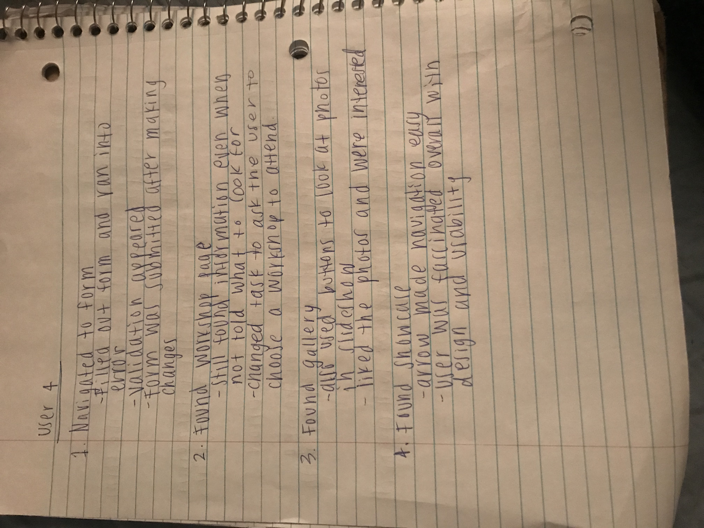

### User 4 (Final Submission)
> Using your notes from above, describe your user by answering the questions below.

1. Who is your user, e.g., where does the user come from, what is the user's job, characteristics, etc.?

User 4 is once again a female at Cornell. She is a senior and a captain of the swim team in the College of Engineering. This user is the oldest of the other 3 users and being in engineering can produce different results in these tasks.

2. Does the user belong to your target audience of the site? (Yes / No)
> If “No”, what’s your strategy of associating the user test results to your target audience’s needs and wants? How can your re-design choices based on the user tests make a better fit for the target audience?

Yes, user 4 is part of the target audience

### User 4 - **Mobile** (Final Submission)
> Report the results of your user's evaluation. You should explain **what the user did**, describe the user's **reaction/feedback** to the design, **reflect on the user's performance**, determine what **re-design choices** you will make. You can also add any additional comments. See the example design journey for an example of what this would look like.

Task: ALL
- **Did you evaluate the desktop or mobile design?**
  - Pick one: Mobile
- **How did the user do? Did they meet your expectation?**
  - User 4 performed very similarly to user 3 and was able to navigate the gallery page. The validations of the form worked and the form was submitted. On the second task, I decided to let the user choose which dance workshop they wanted to attend to make it more interactive and the results were the same as if the dance was just given to them

- **User’s reaction / feedback to the design** (e.g., specific problems or issues found in the tasks)
  - There were no issues and the tasks ran very smoothly
- **Your reflections about the user’s performance to the task**
  - The performance of this user let me conclude that the gallery page will remain the same and the rest of the site is easy to navigate. I have also concluded that there has to be some kind of interest for the users to be engaged in the design and contents of the site.
- **Re-design choices**
  - N/A
- **Additional Notes**
  - The user tests were performed when our website was already polished and pretty much finalized which is why re-design choices were not necessary and the usability of the site was smooth. The results were also pretty redundant and there were only 2 tasks that there were any issues which is why I didn't feel it necessary to fill out a task evaluation for each individual task.

...


### User 5 - Testing Notes (Final Submission)
> When conducting user testing, you should take notes during the test. Place your notes here.


### User 5 (Final Submission)
> Using your notes from above, describe your user by answering the questions below.

Because we did this test right after a dancing rehearsal, I didn't have pen and paper with me. So I typed things down on my phone, and I will just transfer them here:

For task one, the user looks at the nav bar and clicks on "apply now". She reads through the description and tests the form by applying as the president. Her inputs for the last few questions didn't pass the validation, but she was able to fix them according to the error messages.

For task two, I phrase the it so that the user should be looking specifically for jazz workshop. She looks over the nav bar again and goes directly to workshop page. She then clicks on the jazz subtitle, and the page toggles to show the information.

For the third task, she clicks on gallery right away. She plays with the slide show a little, and she thinks it is really cool.

Last task, she thinks for a bit, and decides to click on event. She then clicks on showcase from the dropdown menu.


1. Who is your user, e.g., where does the user come from, what is the user's job, characteristics, etc.?

My user is Destiny, and she is a Cornell sophomore. She is very interested in dancing, and we are involved in two swing dance clubs together. She told me that she is interested in exploring other types of dances.

2. Does the user belong to your target audience of the site? (Yes / No)
> If “No”, what’s your strategy of associating the user test results to your target audience’s needs and wants? How can your re-design choices based on the user tests make a better fit for the target audience?

Yes, she belongs to the target audience group.

### User 5 - **Desktop** (Final Submission)
> Report the results of your user's evaluation. You should explain **what the user did**, describe the user's **reaction/feedback** to the design, **reflect on the user's performance**, determine what **re-design choices** you will make. You can also add any additional comments. See the example design journey for an example of what this would look like.

Task: All
- **Did you evaluate the desktop or mobile design?**
  - Pick one: desktop
- **How did the user do? Did they meet your expectation?**
  - The testing went really smoothly, and the user's performance met my expectation. She successfully completely all the tasks, even though she had to think for a few seconds before clicking on the pages. But I believe this is completely normal.
- **User’s reaction / feedback to the design** (e.g., specific problems or issues found in the tasks)
  - She thinks this is really cool, and she appreciates that she can do it.
- **Your reflections about the user’s performance to the task**
  - I think the testing with this user goes pretty well, and it seems like our website is easy to navigate through for a target user.
- **Re-design choices**
  - N/A
- **Additional Notes**
  - N/A

...


### User 6 - Testing Notes (Final Submission)
> When conducting user testing, you should take notes during the test. Place your notes here.

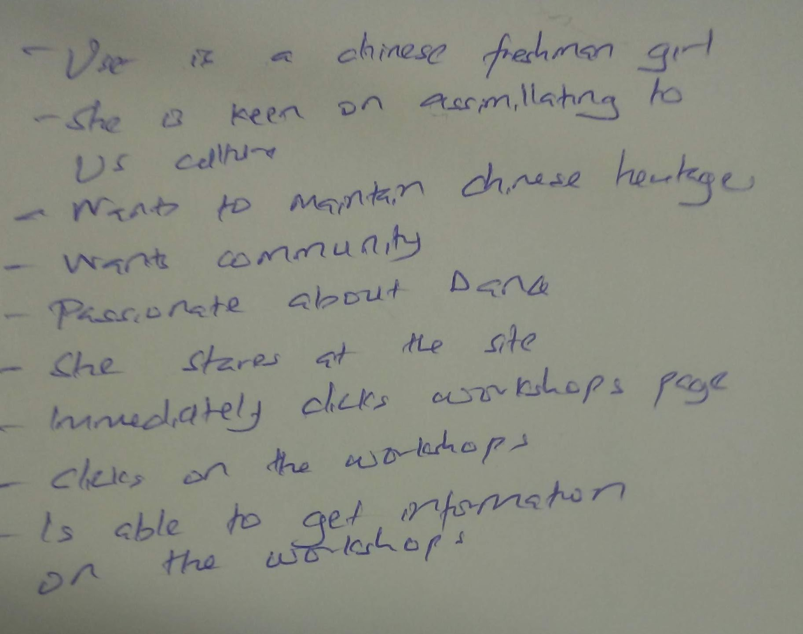


### User 6 (Final Submission)
> Using your notes from above, describe your user by answering the questions below.

1. Who is your user, e.g., where does the user come from, what is the user's job, characteristics, etc.?

The user is a freshman keen on engaging in campus through her love of dancing. She wants to maintain her chinese heritage while getting immersed in American culture

2. Does the user belong to your target audience of the site? (Yes / No)
> If “No”, what’s your strategy of associating the user test results to your target audience’s needs and wants? How can your re-design choices based on the user tests make a better fit for the target audience?

Yes, she does

### User 6 - **Mobile** (Final Submission)
> Report the results of your user's evaluation. You should explain **what the user did**, describe the user's **reaction/feedback** to the design, **reflect on the user's performance**, determine what **re-design choices** you will make. You can also add any additional comments. See the example design journey for an example of what this would look like.

Task: You want to attend a workshop, but you don't know when and where it is. Find the time and location for the workshop you are interested in attending

- **Did you evaluate the desktop or mobile design?**
  - Pick one: Mobile
- **How did the user do? Did they meet your expectation?**
  - Immediately on seeing the site, she clicks on the workshops page and is able to get the logistical information on all the workshops. This is consistent with my expectation as it is clear on the navbar where one should find information about workshops.
- **User’s reaction / feedback to the design** (e.g., specific problems or issues found in the tasks)
  - The user is pleased by how exhaustive the design is, and how it is easy to get to a page that targets specific aspects of the functionings of the club
- **Your reflections about the user’s performance to the task**
  - Having performed the task without hesitation, I was satisfied with the website's ability to allow a seamless performance of tasks stipulated
- **Re-design choices**
  - N/A
- **Additional Notes**
  - Given the intuitiveness, exhaustiveness and robustness of the implementation of the website, with and intuitive design, there was no need for redesign

...


## Changes Based on User Testing (Final Submission)
> What changes did you make to your design based on user testing?

Since the user testing was performed after the final touches to the design was made, there were no changes done based on user testing. I think this is the way to go when seeing if changes to be made because it tests the final design rather than the progress which yields more useful results. In the case that we did not have milestone feedback it may be better to use user tests as feedback for each stage of the design process.


## Final Notes to the Graders (Final Submission)
> 1. Give us three specific strengths of your site that sets it apart from the previous website of the client (if applicable) and/or from other websites. Think of this as your chance to argue for the things you did really well.

First, since our client wanted a mostly informative website, we did a really good job iterating through card sorting and finding the best organization of content. We do not want to confuse users with all sorts of information about Amber Dance Troupe, but we also aim to make the website as comprehensive as possible, so that we can highlight all the awesome aspects of this club. Hence, you will see that our website is very well organized: the history and mission of the club (which our client values the most) are on the homepage, and we have different pages that show the people, the activities, the performances, the achievements, and the invitation to join. From our user testing, you can also see that the target audience has no difficulties finding any information.

Following the previous point, we designed interactivities that really help potential users to gather information. For instance, because a Cornellian can be very busy and is mostly likely to be interested in one type of dance workshop, our workshop page does not feed users with information they do not need. Users can check on specific workshop information through the toggles. Meanwhile, the potential user maybe interested in the club in various ways: they may want to check out a performance, they many want to see a collection of dances by going to the showcase, they may just want to hang out with club members, or they may want to get more involved. Our event dropdown menu and application form are all tailored towards these needs. They are clear and easy to navigate.

Last but not least, we did well overall in designing the look of the website. For this performing club, we tried our best to make the website as visually pleasing as possible. Our contents are well aligned and clearly separated. We also use well matched colors like green, gray, and white. While these colors represent Amber Dance Troupe, they also look very good on the website: they create a soothing but hopeful theme, and they have cultural meaning for representing ethereal people/things in Chinese history. In finding out such combination of colors and playing with it on different sections, we manage to convey relevant messages through the look of our website.

> 2. Tell us about things that don't work, what you wanted to implement, or what you would do if you keep working with the client in the future. Give justifications.

In the future, after our client decides the date and time for perforances and social activities, we can add more interactive feature to the website. We can make the website only display events that will happen after the day of access. This will help our client's website to look more professional and easier to navigate. User who visit the website will be able to get updated information about the club's schedule. This will further realize the goal of promoting the club through webstie.

> 3. Tell us what you, as a team, learned while working on this project.

As a team, we learned to help out each other and take responsibility together. When we didn't do very well on one milestone, we work hard together to make sure we get things done by the next due date. If we need help or things don't work out, we know that we should reach out to the group.

We also learn to communicate efficiently. If a few team members are not in town, we make group skype calls or talk over group chat to distribute work.

Before starting, we also work as a team to make sure we are on track. We check in with each other as well as update our own progress in our group chat. We agree on a time to finish our parts, and we all try our best to honor that.

> 4. Tell us anything else you need us to know for when we're looking at the project.
