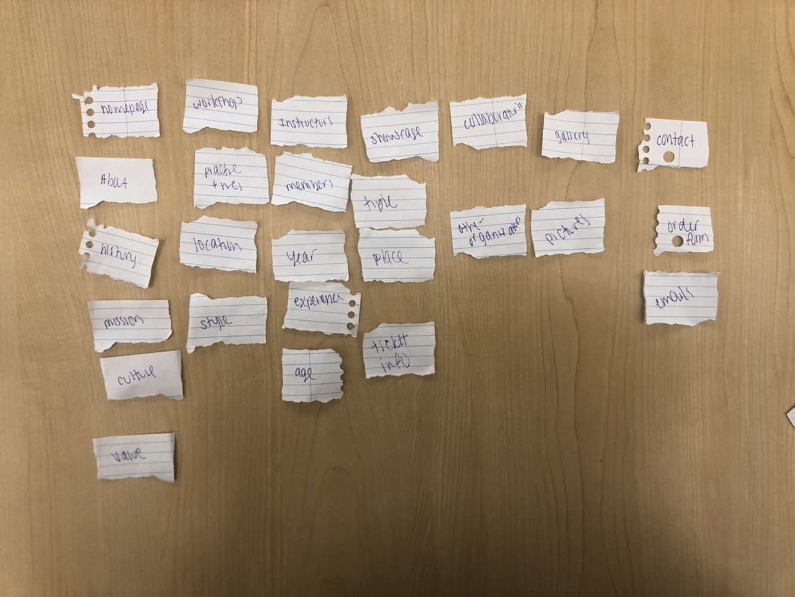

# Project 4 - Design & Plan

Be clear and concise in your writing. Bullets points are acceptable.


# Planning

## Client Description (Milestone 1)
> Tell us about your client. Who is your client? What kind of website do they want? What are their key goals?

Our client is Amber Dance Troupe, founded in 2003. This is performing group that focuses on promoting Chinese tradition folk dance, contemporary dance, and jazz. The hold workshops every week, perform across campus, and hold annual showcase.

They want an informative website, and they also want to include recruitment information. They want a website that is welcoming for target audience, and they want to promote the club as well as its cultural influence. Further details are included in the purpose section.

> NOTE: **If you are redesigning an existing website, give us the current URL and some screenshots of the current site.** Tell us how you plan to update the site in a significant way that meets the Project 4 requirements.


## Site's Purpose (Milestone 1)
> Tell us the purpose of the website and what it is all about.

We are making a website for Amber Dance Troupe (focusing on Chinese tradition/folk dance, contemporary dance, and jazz), and this cite will be an informative presentation of the club; it should also contain information/form for E-Members, G-Members to look over and interact with.

Our client's target audience is female Cornellians who are committed to dancing. But our clients expect all these types of people to visit the site:
  1. dancers who are interested in Amber specifically
  2. people who have heard about the club but are looking for more information about the club
  3. club member to look up for workshop information, application/order forms, etc.
  4. Cornell administration to ensure that the club is actually holding events
  5. Other performing art clubs that are looking for collaboration

Here are some pages/information that our client expects to see:
  - information about club history
  - information about current workshops
  - E-board introduction and recruitment info
  - instructors introduction
  - annual showcase information
  - event page: performance schedule + social events
  - order form for club members (to collect information about costume size)
  - club contact info
  - photo gallery


## Client Meeting Notes (Milestone 1)
> Include your notes/minutes from the client meeting, an email they sent you, or whatever you used to keep track of what was discussed at the meeting.


## Client Needs and Wants (Milestone 1)
> Collect your client's needs and wants for the website. Come up with several appropriate design ideas on how those needs may be met. In the **Memo** field, justify your ideas and add any additional comments you have. There is no specific number of needs required for this, but you need enough to do the job.

Needs/Wants: Color Scheme
- **Needs and Wants** [What does your client need and want?]
  - Color scheme matches the club's color
- **Design Ideas and Choices** [How will you meet those needs and wants?]
  - Use a bluish green (e.g. #49989c ) and white as part of design
- **Memo** [Justify your decisions; additional notes.]
  - N/A

Needs/Wants: Club History & interaction element
- **Needs and Wants**
  - The club was founded in 2003, and it has a very rich history. Our client values it, and wants to make sure that club history is on the site.
- **Design Ideas and Choices**
  - Create a page on club history
  - Have a photo gallery for past performances
- **Memo**
  - N/A

Needs/Wants: Workshops and Instructors Information
- **Needs and Wants**
  - Workshop is a big part of the club's activities, and my client expects many people to look for workshop and Instructors information together: people who are interested in the club, club members, other performing arts clubs, etc.
  - Because the club hosts 3 or 4 workshops per week, there will a big list of workshops. So, my client expects that we can sort workshops by the type of dance (tradition dance, contemporary dance, jazz).
- **Design Ideas and Choices**
  - Create a page on workshops and corresponding Instructors
  - allow sorting
  - Make sure this information is easy to navigate to on the front page
- **Memo**
  - N/A

Needs/Wants: Events
- **Needs and Wants**
  - The club is always invited by many other organizations, and the our client wants to show their performance schedule on their site
  - The club hosts one formal and one semi-formal event every semester; this will be for club members only
- **Design Ideas and Choices**
  - Create a page on performance schedule; maybe make this page interactive and can update based on the date of access (the client says we don't have to do this)
  - Create a page on social event, talk about dates and location
- **Memo**
  - N/A

Needs/Wants: Contact
- **Needs and Wants**
  - Our client wants to make sure that people who are interested in the club (to join or to collaborate) can contact the club
- **Design Ideas and Choices**
  - We can either create a page for contact info, or (according to the client's suggestion) we can put contact info in the footer
- **Memo**
  - N/A

Needs/Wants: Eboard Member and Recruitment & interactive element
- **Needs and Wants**
  - This page will be for current club members, and this page should be interactive so that members can submit application
- **Design Ideas and Choices**
  - Create a page that introduces current Eboard
  - Add a form at the end of the page for application
- **Memo**
  - N/A

Needs/Wants: Annual Showcase
- **Needs and Wants**
  - The club holds an annual showcase at the end of spring semester. This is a big event for the club.
- **Design Ideas and Choices**
  - Create a page on annual showcase information
- **Memo**
  - N/A

Needs/Wants: Costume Order Form & interactive element
- **Needs and Wants**
  - Because the club need to order costume for members who are part of a dance performance, so it is important for the club to collect information on the costume size of each dancer.
- **Design Ideas and Choices**
  - Create a page for order page, and the page will be a form.
- **Memo**
  - N/A


## User(s) (Milestone 1)
> Tell us about the users (target audience) for this website.

Our overall target audience is females at Cornell University. However, our target audience is broken down into three different sectors.  The first sector is targeted at females that are already in the dance group. This allows the entire group to collaborate with each other and keep up to date on current events and competitions. The second sector is for any females at Cornell University that are interested in joining a dance group or becoming more involved in the dance world (no experience necessary). Finally, the third sector is targeted at other clubs on campus that would like to partner or promote or dance troupe. It can be targeted at other organizations that would like to get involved.

## Discovering Users' Needs (Milestone 1)
<<<<<<< HEAD

=======

- Notes for Female who is interested in joining a dance troupe and has a passion for dance and practicing.


> You'll need to discover your users' needs. Talk to them! Document what you've learned about them. When talking to your users, take notes and include those notes here.

Note for club member interview


Interview with potential collaborator:
Member of jazz group
Has collaborated with other groups before

How did your group contact the other groups you have collaborated with?
- They have usually known someone in the group, and talked with that person about collaborating
- This talking was usually done over phone or in a group chat

What about these other groups convinced you to collaborate with them?
- Again, they knew people from the other groups, and thought it would be fun to collaborate with them
- They saw that they liked the other groups work and like it
- They thought they would work well together

What kind of information would be helpful to get together with a group you might want to collaborate with?
- Contact information, cellphone number or email
- general information about the group, when they meet, what kind of work they do, the general work attitude they have

>>>>>>> 3396501c503d463e5a07dd6edea32e2f70d1c9b2

## Users' Needs (Milestone 1)
> Analyze the users' needs and wants from your notes above. List each need/want below. There is no specific number of needs required for this, but you need enough to do the job.
> **Note:** These are probably *not* the needs of your client.

Need/Want: Culture
- **Needs and Wants** [What do the users need and want?]
  - The user wants to know the culture or the group and what the entire groups mission and goals are
- **Design Ideas and Choices** [How will you meet those needs and wants?]
  - Creating a page that reflects the history as well as the key values
- **Rationale & Additional Notes** [Justify your decisions; additional notes.]
  - N/A

Need/Want: Practice Times
- **Needs and Wants** [What do the users need and want?]
    - The user wants to know the commitment level and different practice times or workshops that are offered and when
- **Design Ideas and Choices** [How will you meet those needs and wants?]
    - Creating a page that is designated to practice times and workshops. It will also include the location of the meetings.
- **Rationale & Additional Notes** [Justify your decisions; additional notes.]
    - N/A

Need/Want: Leaders
- **Needs and Wants** [What do the users need and want?]
    - The user wants to know the leaders in the group
- **Design Ideas and Choices** [How will you meet those needs and wants?]
    - Creating a page that is designated to who is in charge and different members that are in the group
- **Rationale & Additional Notes** [Justify your decisions; additional notes.]
    - N/A

Need/Want: Photos/Videos
- **Needs and Wants** [What do the users need and want?]
    - The user wants to be able to view photographs and videos to judge skill level
- **Design Ideas and Choices** [How will you meet those needs and wants?]
    - Creating a page that is designated to a specific gallery in order to attract more individuals
- **Rationale & Additional Notes** [Justify your decisions; additional notes.]
    - N/A

Need/Want: Equipment/Prices
- **Needs and Wants** [What do the users need and want?]
    - The user wants to be able to know the specific costs and any equipment  they need to buy in order to successfully integrate themselves in the club
- **Design Ideas and Choices** [How will you meet those needs and wants?]
    - Under the about page it will include a form where females can sign up for sizes for costumes. It will also list the total cost of the club
- **Rationale & Additional Notes** [Justify your decisions; additional notes.]
    - N/A
<<<<<<< HEAD
Need/Want: ...
=======
>>>>>>> 3396501c503d463e5a07dd6edea32e2f70d1c9b2

Need/Want: [Club member - Workshops/sessions]
- **Needs and Wants** [What do the users need and want?]
  - Need to know if a workshop is happening: if it is, when and where
  - Only look for particular workshops that one wants to attend
- **Design Ideas and Choices** [How will you meet those needs and wants?]
  - Clearly list the timing and location of every workshop / practice session
  - Enable sorting of workshops/practice by type
- **Rationale & Additional Notes** [Justify your decisions; additional notes.]
  - N/A

Need/Want: [Club member - Instructors]
- **Needs and Wants** [What do the users need and want?]
  - Do not tend to care too much on this
- **Design Ideas and Choices** [How will you meet those needs and wants?]
  - Have a page on intructors for those who may be interested, but not combine with workshops
- **Rationale & Additional Notes** [Justify your decisions; additional notes.]
  - N/A

Need/Want: [Club member - Event]
- **Needs and Wants** [What do the users need and want?]
  - Time for social event is importance
  - Time, location, and practice workshop for performance is important
- **Design Ideas and Choices** [How will you meet those needs and wants?]
@@ -165,28 +229,45 @@
- **Rationale & Additional Notes** [Justify your decisions; additional notes.]
  - N/A

Need/Want: [Non Club member - Collaborator]
- **Needs and Wants**
  - Need information about how to contact the group
  - Information about the type of collaboration the group is interested in working on
- **Design Ideas and Choices**
  - A page about collaboration could be made that provides contact information as well as specifics about collaborating with the dance troupe.
- **Rationale & Additional Notes**
  -
<<<<<<< HEAD
=======

>>>>>>> 3396501c503d463e5a07dd6edea32e2f70d1c9b2

## User Testing Plan (Milestone 1)
> Plan out your tasks for evaluating whether your site will meet the needs of the users. These must be actual user testing tasks. Tasks are not questions!


1. You found a flyer that said Amber Dance Troupe is now taking applications to join. Navigate through the website to apply to be a part of the team.

2. You want to attend a workshop, but you don't know when and where it is. Find the time and location for the next workshop.

3. You are part of a band and you want to collaborate with Amber Dance Troupe. Navigate the website to find out who to contact.

4. It's the spring and you want to find more things to do. You are interested in attending the annual showcase. Navigate to get more information on the event.


## Content (Milestone 1)
> Plan out your site's content (text, images, etc.). Make a list of **all** the content you will need. This list should be **exhaustive**.

- Homepage (i.e history, mission, values, culture)
- Current Workshops(i.e practice times, locations, types of workshops)
- eBoard and Instructors(photos and description of positions)
- For Members (application and forms)
- Annual Showcase
- Gallery
- Contact (i.e collaboration)

## Interactivity Ideas (Milestone 1)
> Come up with some idea for interactive features for your site.

- Forms
- Gallery
- Sorting

# Design & Evaluation

## Design Process (Milestone 1)
> Document your design process. Show us your card sorting. Design your navigation from the card sorting. Outline your navigation. Describe your theme. Show us sketches of your site (mobile and desktop versions). etc.
> You should show us how your came up with your design and how your iterated on that design; show us the evolution of your design.

> **Note:** Card sorting is used to organize your site's content. For each piece of content identified in the previous section, write a summary of that content onto a card. Now sort the cards. The grouping of cards provides you with your pages for your website. **Do not write down the pages you want and then "card sort" those. That is not card sorting.**




## Interactivity (Milestone 1)
> What interactive features will your site have? Describe how the interactivity connects with the needs of the clients/target audience.

Forms: part of the purpose of the website is to recruit, and that includes E-board application. The current club member is also part of the user of the website, and they need to submit information about their costume sizes. Hence, a form can help my client to gather information on running the club in the future.

Photo gallary: as a performing group, our client has many photos on their past performances and practices. Since they want to promote the club, and one way to do that is to present their hard works in the past. Plus, when it comes to performing art, it is easier to show the purpose and dedication through some visual components, like photos. So, a photo gallary will help our client to better achieve another main purpose of their website: to promote the club.

Sorting: the website is also serving currect club members. These members are interested in different types of dances, and they need information on their own workshops and practices. Yet, these members, as Cornell students, are busy. They won't want to waste time on trying to browse through all the workshops and practice sessions every time. So, enabling a sorting function for workshops saves time for club members to better find inforamtion for themselves.


## User Testing (_optional_)
> This testing is optional.

### User 1 - Testing Notes (Milestone 1)
> When conducting user testing, you should take notes during the test. Place your notes here.


### User 1 (Milestone 1)
> Using your notes from above, describe your user by answering the questions below.

1. Who is your user, e.g., where does the user come from, what is the user's job, characteristics, etc.?


2. Does the user belong to your target audience of the site? (Yes / No)
> If “No”, what’s your strategy of associating the user test results to your target audience’s needs and wants? How can your re-design choices based on the user tests make a better fit for the target audience?


### User 1 - **Desktop** (Milestone 1)
> Report the results of your user's evaluation. You should explain **what the user did**, describe the user's **reaction/feedback** to the design, **reflect on the user's performance**, determine what **re-design choices** you will make. You can also add any additional comments. See the example design journey for an example of what this would look like.

Task: [TODO: copy task here]
- **Did you evaluate the desktop or mobile design?**
  - Pick one: desktop/mobile
- **How did the user do? Did they meet your expectation?**
  - TODO
- **User’s reaction / feedback to the design** (e.g., specific problems or issues found in the tasks)
  - TODO
- **Your reflections about the user’s performance to the task**
  - TODO
- **Re-design choices**
  - TODO
- **Additional Notes**
  - TODO: Justify your decisions; additional notes.

...


### User 2 - Testing Notes (Milestone 1)
> When conducting user testing, you should take notes during the test. Place your notes here.


### User 2 (Milestone 1)
> Using your notes from above, describe your user by answering the questions below.

1. Who is your user, e.g., where does the user come from, what is the user's job, characteristics, etc.?


2. Does the user belong to your target audience of the site? (Yes / No)
> If “No”, what’s your strategy of associating the user test results to your target audience’s needs and wants? How can your re-design choices based on the user tests make a better fit for the target audience?


### User 2 - **Mobile** (Milestone 1)
> Report the results of your user's evaluation. You should explain **what the user did**, describe the user's **reaction/feedback** to the design, **reflect on the user's performance**, determine what **re-design choices** you will make. You can also add any additional comments. See the example design journey for an example of what this would look like.

Task: [TODO: copy task here]
- **Did you evaluate the desktop or mobile design?**
  - Pick one: desktop/mobile
- **How did the user do? Did they meet your expectation?**
  - TODO
- **User’s reaction / feedback to the design** (e.g., specific problems or issues found in the tasks)
  - TODO
- **Your reflections about the user’s performance to the task**
  - TODO
- **Re-design choices**
  - TODO
- **Additional Notes**
  - TODO: Justify your decisions; additional notes.

...


## Final Design (Milestone 1)
> Include the final sketches for each of your pages. These sketches **must** hand-drawn.

**Desktop Design:**


**Mobile Design:**

* Sketches of the mobile site:


## Additional Comments (Milestone 1)
> If you feel like you haven't fully explained your design choices, or if you want to explain some other functions in your site (such as special design decisions that might not meet the Project 4 requirements), you can use this space to justify your design choices or ask other questions about the project and process.


---

# Iteration 2

## Client Feedback (Milestone 2)
> You have met once with your client a second time to discuss your initial design. Include your notes from the meeting, an email they sent you, or whatever you used to keep track of what was discussed at the meeting. Write a few sentences about the design feedback you received from your client.


## Interactivity Plan (Milestone 2)
> Write your interactivity pseudocode here.

Example:
```
when DOM is loaded:

  if today is a monday:
    show Monday's soup and Monday's daily special

```

## Additional Comments (Milestone 2)
> If you feel like you haven't fully explained your design choices, or if you want to explain some other functions in your site (such as special design decisions that might not meet the Project 4 requirements), you can use this space to justify your design choices or ask other questions about the project and process.


---

# Iteration 3

## Additional Comments (Milestone 3)
> If you feel like you haven't fully explained your design choices, or if you want to explain some other functions in your site (such as special design decisions that might not meet the Project 4 requirements), you can use this space to justify your design choices or ask other questions about the project and process.


---

# Final Evaluation

## Changes Based on Lab 13 Peer Feedback (Final Submission)
> What changes did you make to your design based on your peers' feedback?


## User Testing
> If you conducted user testing in Milestone 1, you only need to user test 2 more users. Otherwise, you must conduct user testing with 4 users.

### User 3 - Testing Notes (Final Submission)
> When conducting user testing, you should take notes during the test. Place your notes here.


### User 3 (Final Submission)
> Using your notes from above, describe your user by answering the questions below.

1. Who is your user, e.g., where does the user come from, what is the user's job, characteristics, etc.?


2. Does the user belong to your target audience of the site? (Yes / No)
> If “No”, what’s your strategy of associating the user test results to your target audience’s needs and wants? How can your re-design choices based on the user tests make a better fit for the target audience?


### User 3 - **Desktop** (Final Submission)
> Report the results of your user's evaluation. You should explain **what the user did**, describe the user's **reaction/feedback** to the design, **reflect on the user's performance**, determine what **re-design choices** you will make. You can also add any additional comments. See the example design journey for an example of what this would look like.

Task: [TODO: copy task here]
- **Did you evaluate the desktop or mobile design?**
  - Pick one: desktop/mobile
- **How did the user do? Did they meet your expectation?**
  - TODO
- **User’s reaction / feedback to the design** (e.g., specific problems or issues found in the tasks)
  - TODO
- **Your reflections about the user’s performance to the task**
  - TODO
- **Re-design choices**
  - TODO
- **Additional Notes**
  - TODO: Justify your decisions; additional notes.

...


### User 4 - Testing Notes (Final Submission)
> When conducting user testing, you should take notes during the test. Place your notes here.


### User 4 (Final Submission)
> Using your notes from above, describe your user by answering the questions below.

1. Who is your user, e.g., where does the user come from, what is the user's job, characteristics, etc.?


2. Does the user belong to your target audience of the site? (Yes / No)
> If “No”, what’s your strategy of associating the user test results to your target audience’s needs and wants? How can your re-design choices based on the user tests make a better fit for the target audience?


### User 4 - **Mobile** (Final Submission)
> Report the results of your user's evaluation. You should explain **what the user did**, describe the user's **reaction/feedback** to the design, **reflect on the user's performance**, determine what **re-design choices** you will make. You can also add any additional comments. See the example design journey for an example of what this would look like.

Task: [TODO: copy task here]
- **Did you evaluate the desktop or mobile design?**
  - Pick one: desktop/mobile
- **How did the user do? Did they meet your expectation?**
  - TODO
- **User’s reaction / feedback to the design** (e.g., specific problems or issues found in the tasks)
  - TODO
- **Your reflections about the user’s performance to the task**
  - TODO
- **Re-design choices**
  - TODO
- **Additional Notes**
  - TODO: Justify your decisions; additional notes.

...


### User 5 - Testing Notes (Final Submission)
> When conducting user testing, you should take notes during the test. Place your notes here.


### User 5 (Final Submission)
> Using your notes from above, describe your user by answering the questions below.

1. Who is your user, e.g., where does the user come from, what is the user's job, characteristics, etc.?


2. Does the user belong to your target audience of the site? (Yes / No)
> If “No”, what’s your strategy of associating the user test results to your target audience’s needs and wants? How can your re-design choices based on the user tests make a better fit for the target audience?


### User 5 - **Desktop** (Final Submission)
> Report the results of your user's evaluation. You should explain **what the user did**, describe the user's **reaction/feedback** to the design, **reflect on the user's performance**, determine what **re-design choices** you will make. You can also add any additional comments. See the example design journey for an example of what this would look like.

Task: [TODO: copy task here]
- **Did you evaluate the desktop or mobile design?**
  - Pick one: desktop/mobile
- **How did the user do? Did they meet your expectation?**
  - TODO
- **User’s reaction / feedback to the design** (e.g., specific problems or issues found in the tasks)
  - TODO
- **Your reflections about the user’s performance to the task**
  - TODO
- **Re-design choices**
  - TODO
- **Additional Notes**
  - TODO: Justify your decisions; additional notes.

...


### User 6 - Testing Notes (Final Submission)
> When conducting user testing, you should take notes during the test. Place your notes here.


### User 6 (Final Submission)
> Using your notes from above, describe your user by answering the questions below.

1. Who is your user, e.g., where does the user come from, what is the user's job, characteristics, etc.?


2. Does the user belong to your target audience of the site? (Yes / No)
> If “No”, what’s your strategy of associating the user test results to your target audience’s needs and wants? How can your re-design choices based on the user tests make a better fit for the target audience?


### User 6 - **Mobile** (Final Submission)
> Report the results of your user's evaluation. You should explain **what the user did**, describe the user's **reaction/feedback** to the design, **reflect on the user's performance**, determine what **re-design choices** you will make. You can also add any additional comments. See the example design journey for an example of what this would look like.

Task: [TODO: copy task here]
- **Did you evaluate the desktop or mobile design?**
  - Pick one: desktop/mobile
- **How did the user do? Did they meet your expectation?**
  - TODO
- **User’s reaction / feedback to the design** (e.g., specific problems or issues found in the tasks)
  - TODO
- **Your reflections about the user’s performance to the task**
  - TODO
- **Re-design choices**
  - TODO
- **Additional Notes**
  - TODO: Justify your decisions; additional notes.

...


## Changes Based on User Testing (Final Submission)
> What changes did you make to your design based on user testing?


## Final Notes to the Graders (Final Submission)
> 1. Give us three specific strengths of your site that sets it apart from the previous website of the client (if applicable) and/or from other websites. Think of this as your chance to argue for the things you did really well.


> 2. Tell us about things that don't work, what you wanted to implement, or what you would do if you keep working with the client in the future. Give justifications.


> 3. Tell us what you, as a team, learned while working on this project.


> 4. Tell us anything else you need us to know for when we're looking at the project.
